# FarmTech Solutions — Fase 3

## Banco de Dados Oracle para o Sistema de Irrigação da Araucária

Projeto desenvolvido para a disciplina **Banco de Dados** da FIAP — curso de IA, Fase 3.
Dá continuidade ao sistema de irrigação inteligente da **Fase 2** ([leticiael/Farmtech-ESP32-](https://github.com/leticiael/Farmtech-ESP32-)), persistindo as leituras dos sensores do ESP32 em um banco **Oracle** e explorando os dados por meio de consultas SQL.

Vídeo demonstrativo (≤ 5 min): [Vídeo demonstrativo do dashboard](https://www.youtube.com/watch?v=WqOEoQaPj4g)
Site hospedado: [https://araucaria.streamlit.app/](https://araucaria.streamlit.app/)

---

## Objetivo da Fase 3

Migrar os dados produzidos pelo firmware embarcado no ESP32 (Fase 2) para um banco relacional Oracle, criando uma camada analítica sobre as leituras dos sensores de **NPK**, **pH**, **umidade** e **temperatura** do viveiro de mudas de *Araucaria angustifolia*. Com os dados no banco, passamos a poder:

- Conferir o histórico de acionamentos da bomba e cruzá-lo com as condições agronômicas registradas.
- Localizar períodos de stress hídrico, encharcamento ou desequilíbrio nutricional.
- Sugerir janelas operacionais para alocação de água via consultas agregadas.

---

## Conexão com a Fase 2

Na Fase 2, um **ESP32** monitorava os sensores e acionava o relé da bomba quando **todas** as condições agronômicas eram favoráveis. A decisão era impressa no Serial Monitor a cada 2 segundos, no formato:

```
N:1 P:1 K:1 | pH: 5 | umid:50.0% temp:24.0C | bomba:ON
```

O firmware original (`src/sketch.ino`) é mantido aqui sem alterações, como referência do _ground truth_ que originou os dados. A regra de irrigação foi reproduzida fielmente no script Python que gera o dataset desta fase.

---

## Estrutura do repositório

```
farmtech-db-oracle/
├── dados/
│   └── dados_sensores_fase2.csv     # 100 leituras simuladas (UTF-8, vírgula)
├── prints/                          # Capturas de tela do Oracle SQL Developer
├── scripts/
│   ├── gerar_dados.py               # Gera o CSV reproduzindo a lógica do sketch
│   └── consultas.sql                # CREATE TABLE + 10 consultas analíticas
├── src/
│   └── sketch.ino                   # Firmware da Fase 2 (referência)
├── iralem1_dashboard/               # Ir Além 1 — Dashboard interativo (Streamlit)
│   ├── app.py
│   ├── src/                         # data_loader, charts, weather, decisao
│   ├── prints/                      # Capturas de tela do dashboard
│   ├── requirements.txt
│   ├── .env.example
│   └── .streamlit/config.toml
└── README.md
```

| Caminho | Função |
| --- | --- |
| `dados/dados_sensores_fase2.csv` | Dataset que alimenta a tabela `SENSORES_ARAUCARIA`. |
| `scripts/gerar_dados.py` | Recria o CSV de forma reprodutível. Sem dependências externas. |
| `scripts/consultas.sql` | Cria a tabela e executa as 10 consultas analíticas. |
| `src/sketch.ino` | Cópia exata do firmware da Fase 2, para referência cruzada da lógica. |
| `prints/` | Pasta destinada às evidências do banco em execução. |
| `iralem1_dashboard/` | Dashboard Streamlit que consome o CSV + integra OpenWeather. Detalhes na seção [Ir Além 1](#ir-além-1--dashboard-interativo). |

---

## Dados dos sensores

O arquivo `dados/dados_sensores_fase2.csv` contém **100 leituras** simuladas, cobrindo aproximadamente **50 horas** consecutivas de operação do sistema (de **2026-04-01 08:00:00** a **2026-04-03 09:13:00**), com uma leitura a cada ~30 minutos. Os valores reproduzem o comportamento esperado dos sensores do ESP32 em um viveiro de araucárias na região de Curitiba/PR no outono.

### Schema do CSV

| Coluna | Tipo | Domínio | Descrição |
| --- | --- | --- | --- |
| `timestamp` | string | `YYYY-MM-DD HH:MM:SS` | Momento da leitura, ~30 min entre amostras. |
| `n` | inteiro | `0 / 1` | Nitrogênio presente (1) ou ausente (0). |
| `p` | inteiro | `0 / 1` | **Fósforo presente** (nutriente crítico para enraizamento). |
| `k` | inteiro | `0 / 1` | Potássio presente. |
| `ph` | inteiro | `0–14` | pH do solo derivado do LDR (`map()` do firmware retorna inteiro). |
| `umidade` | float | `30.0–95.0` | Umidade relativa do solo, em %. |
| `temperatura` | float | `12.0–28.0` | Temperatura do ar, em °C. |
| `irrigou` | inteiro | `0 / 1` | Decisão final do firmware: bomba acionada (1) ou não (0). |

### Lógica de irrigação (pseudocódigo)

A coluna `irrigou` é calculada por uma função que **replica bit a bit** a regra do firmware (`src/sketch.ino`):

```
LIGA bomba SE:
    umidade < 60%             (solo seco)
  E pH ∈ [5, 7]               (acidez ideal para araucária)
  E umidade ≤ 75%             (não está encharcado)
  E Fósforo presente          (nutriente crítico)
  E (Nitrogênio OU Potássio)  (pelo menos um complementar)
```

A condição `umidade ≤ 75%` é logicamente redundante (já implicada por `umidade < 60%`), porém é mantida no script para preservar 100% de fidelidade ao firmware.

### Cobertura de cenários

O dataset foi construído em blocos temáticos, garantindo que **todos os alertas** do firmware da Fase 2 sejam exercitados:

| Cenário | Quantas leituras |
| --- | --- |
| Solo seco + condições ideais (irriga) | 39 |
| Solo encharcado (`umidade > 75`) | 11 |
| pH fora da faixa (`< 5` ou `> 7`) | 10 |
| Fósforo ausente (`P = 0`) | 7 |
| Nutrientes secundários insuficientes (`N = 0` e `K = 0`) | 10 |
| Umidade adequada (60–75%) | 23 |

A distribuição final fica em **39% `irrigou = 1`** e **61% `irrigou = 0`** — proporção realista para o regime de outono, em que chuvas alternam com janelas secas.

### Como o CSV foi gerado

O script `scripts/gerar_dados.py` produz o arquivo a partir de uma semente fixa (`random.seed(20260401)`), o que garante reprodutibilidade. Ele:

1. Modela a temperatura com **ciclo diurno linear por partes** (mínima ≈ 12 °C às 05h, máxima ≈ 26 °C às 15h, com ruído de ± 1,5 °C).
2. Insere a umidade em **blocos temporais coerentes** (período seco → chuva → secagem → restauração), em vez de sortear valores independentes por leitura.
3. Mantém os nutrientes em **patamares contínuos**, simulando depleção e reposição manual.
4. Recalcula `irrigou` linha a linha pela mesma função do firmware e **valida o CSV** ao final. Inconsistências são impressas e corrigidas antes da escrita.

Sem dependências externas — apenas `csv`, `random` e `datetime` da biblioteca padrão.

---

## Importação no Oracle SQL Developer

### Pré-requisitos

- Oracle Database (XE ou superior) acessível por TNS / Easy Connect.
- Oracle SQL Developer 22.x ou superior.
- Conexão configurada no SQL Developer com usuário que tenha permissão para criar tabelas.

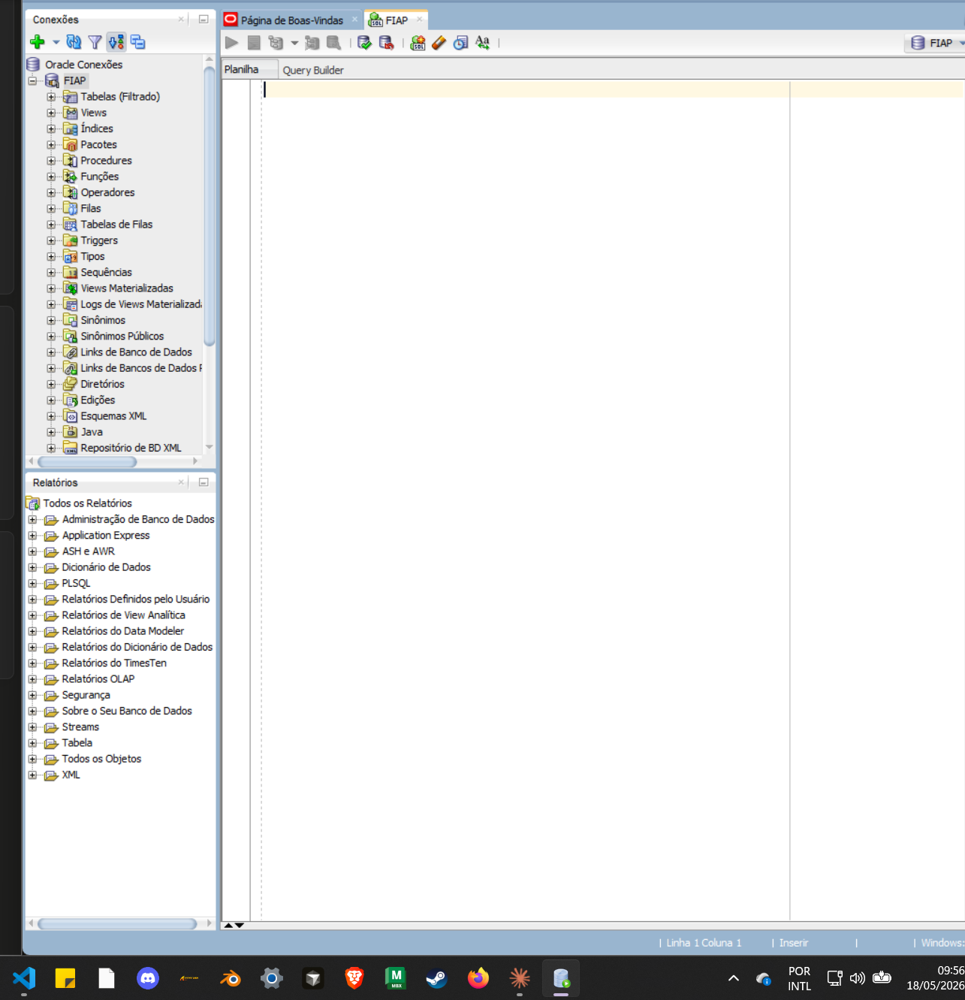

### Passo 1 — Criar a tabela

Abra o arquivo `scripts/consultas.sql` em uma _worksheet_ do SQL Developer e execute o bloco `0 - Estrutura da tabela`. O comando cria a tabela `SENSORES_ARAUCARIA` com _constraints_ que garantem a integridade dos domínios:

```sql
CREATE TABLE SENSORES_ARAUCARIA (
    DATA_LEITURA  DATE        NOT NULL,
    N             NUMBER(1)   NOT NULL,
    P             NUMBER(1)   NOT NULL,
    K             NUMBER(1)   NOT NULL,
    PH            NUMBER(2)   NOT NULL,
    UMIDADE       NUMBER(4,1) NOT NULL,
    TEMPERATURA   NUMBER(4,1) NOT NULL,
    IRRIGOU       NUMBER(1)   NOT NULL,
    CONSTRAINT chk_n        CHECK (N       IN (0, 1)),
    CONSTRAINT chk_p        CHECK (P       IN (0, 1)),
    CONSTRAINT chk_k        CHECK (K       IN (0, 1)),
    CONSTRAINT chk_irrigou  CHECK (IRRIGOU IN (0, 1)),
    CONSTRAINT chk_ph       CHECK (PH BETWEEN 0 AND 14)
);
```

> A coluna `DATA_LEITURA` recebe o que está em `timestamp` no CSV — o nome foi alterado porque `TIMESTAMP` é palavra reservada no Oracle.

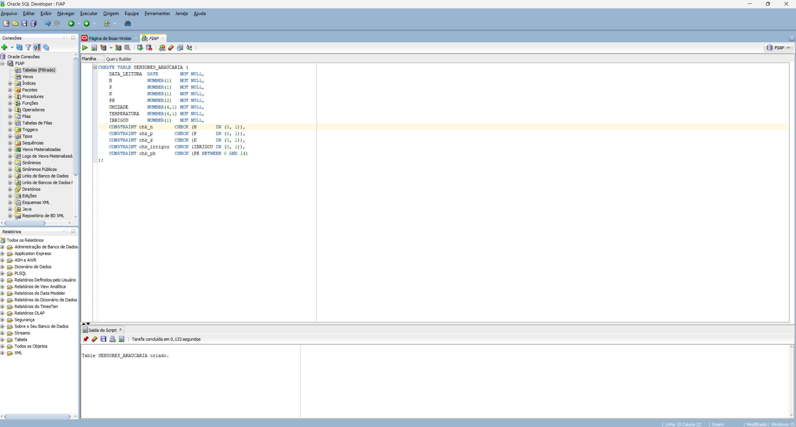

### Passo 2 — Importar o CSV

No painel **Connections**, expanda a sua conexão → **Tables** → clique com o botão direito em `SENSORES_ARAUCARIA` → **Import Data...** → selecione `dados/dados_sensores_fase2.csv`.

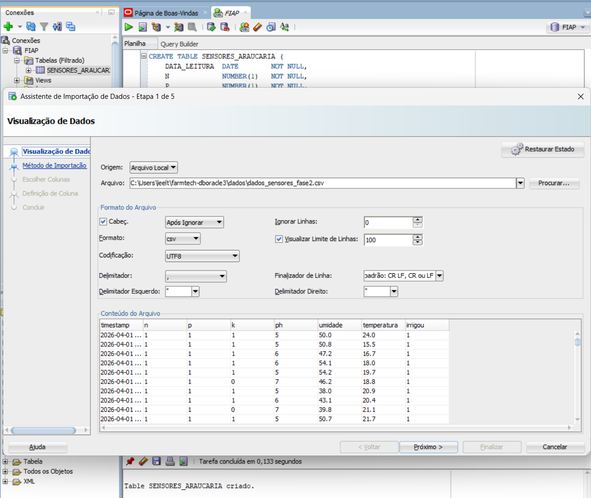

### Passo 3 — Mapear colunas

O mapeamento ocorre **por posição** (já que o CSV usa nomes em minúsculas e o nome `timestamp` foi alterado para `DATA_LEITURA`):

| CSV (origem) | Tabela (destino) | Observação |
| --- | --- | --- |
| `timestamp` | `DATA_LEITURA` | Definir formato **`YYYY-MM-DD HH24:MI:SS`** |
| `n` | `N` | — |
| `p` | `P` | — |
| `k` | `K` | — |
| `ph` | `PH` | — |
| `umidade` | `UMIDADE` | — |
| `temperatura` | `TEMPERATURA` | — |
| `irrigou` | `IRRIGOU` | — |

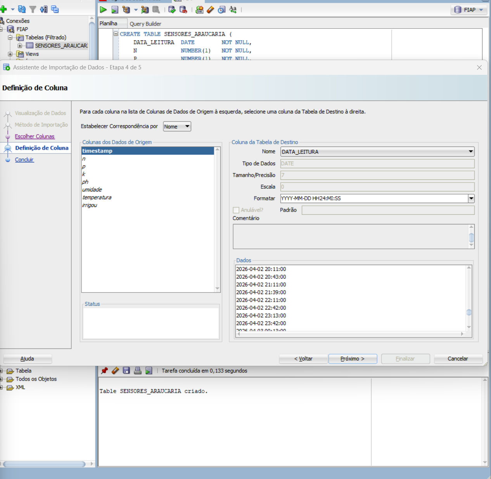

### Passo 4 — Concluir o import

Ao finalizar, o SQL Developer exibe a confirmação com o número de linhas inseridas (**100**).

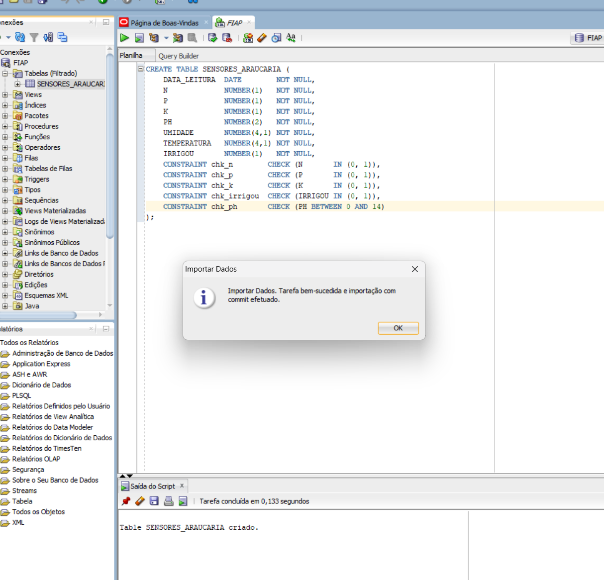

---

## Consultas SQL

As 10 consultas estão em `scripts/consultas.sql` e cobrem desde a listagem completa até classificação agronômica com `CASE WHEN`, subconsulta escalar e agregação com `HAVING`.

### Consulta 1 — Listagem completa

Atende ao requisito `SELECT *` da rubrica.

```sql
SELECT *
FROM SENSORES_ARAUCARIA
ORDER BY DATA_LEITURA;
```

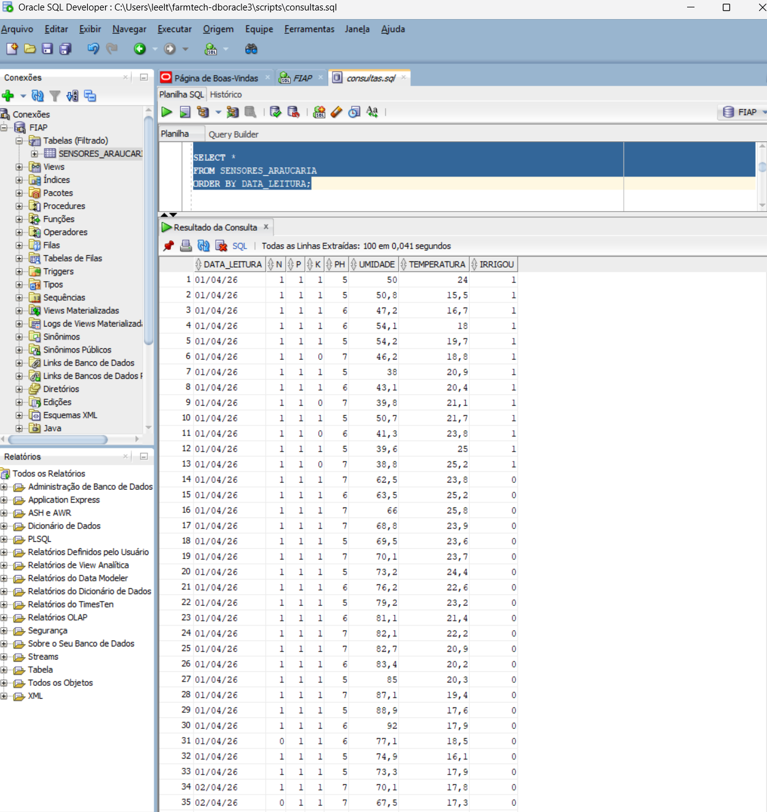

### Consulta 2 — Médias gerais de umidade e temperatura

Caracteriza o microclima do viveiro no período observado.

```sql
SELECT
    COUNT(*)                    AS total_leituras,
    ROUND(AVG(UMIDADE), 2)      AS umidade_media_pct,
    ROUND(AVG(TEMPERATURA), 2)  AS temperatura_media_c
FROM SENSORES_ARAUCARIA;
```

**Resultado esperado:** `total_leituras = 100`, `umidade_media ≈ 54,75 %`, `temperatura_media ≈ 18,90 °C`.

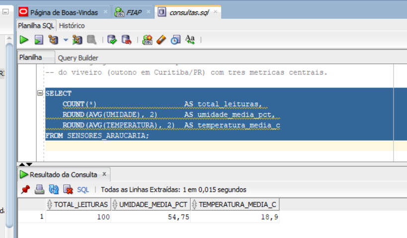

### Consulta 3 — Contagem de irrigações ativas vs inativas

Conta os acionamentos e calcula o percentual de cada estado via subconsulta no `SELECT`.

```sql
SELECT
    IRRIGOU,
    COUNT(*) AS total_leituras,
    ROUND(
        COUNT(*) * 100 / (SELECT COUNT(*) FROM SENSORES_ARAUCARIA),
        1
    ) AS pct_do_total
FROM SENSORES_ARAUCARIA
GROUP BY IRRIGOU
ORDER BY IRRIGOU;
```

**Resultado esperado:** `IRRIGOU = 0 → 61 (61,0 %)`, `IRRIGOU = 1 → 39 (39,0 %)`.

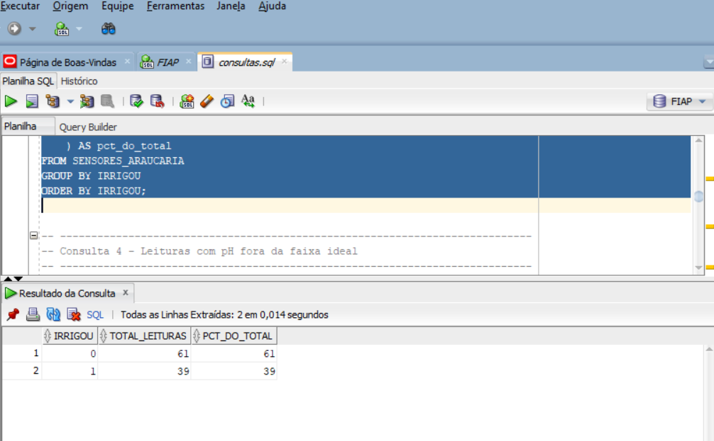

### Consulta 4 — pH fora da faixa ideal

Usa `NOT BETWEEN` para isolar leituras em que o sensor de pH ficou fora do intervalo aceitável para a araucária.

```sql
SELECT DATA_LEITURA, PH, UMIDADE, IRRIGOU
FROM SENSORES_ARAUCARIA
WHERE PH NOT BETWEEN 5 AND 7
ORDER BY DATA_LEITURA;
```

**Resultado esperado:** 10 linhas (Bloco D do dataset).

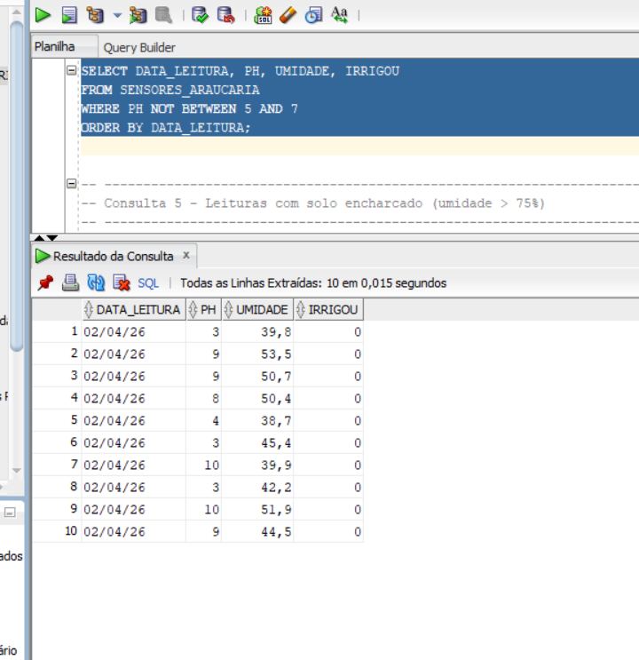

### Consulta 5 — Solo encharcado

Lista as leituras com `umidade > 75 %`, condição que dispara o alerta de risco de podridão radicular.

```sql
SELECT DATA_LEITURA, UMIDADE, TEMPERATURA, IRRIGOU
FROM SENSORES_ARAUCARIA
WHERE UMIDADE > 75
ORDER BY UMIDADE DESC;
```

**Resultado esperado:** 11 linhas.

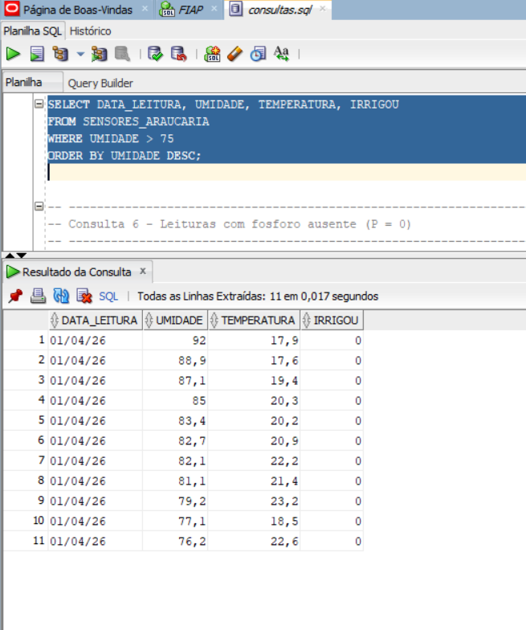

### Consulta 6 — Fósforo ausente

Lista as leituras em que o sensor de fósforo registrou ausência (`P = 0`). Pela regra do firmware, **nenhuma** dessas leituras pode ter `IRRIGOU = 1`.

```sql
SELECT DATA_LEITURA, N, P, K, UMIDADE, PH, IRRIGOU
FROM SENSORES_ARAUCARIA
WHERE P = 0
ORDER BY DATA_LEITURA;
```

**Resultado esperado:** 7 linhas, todas com `IRRIGOU = 0`.

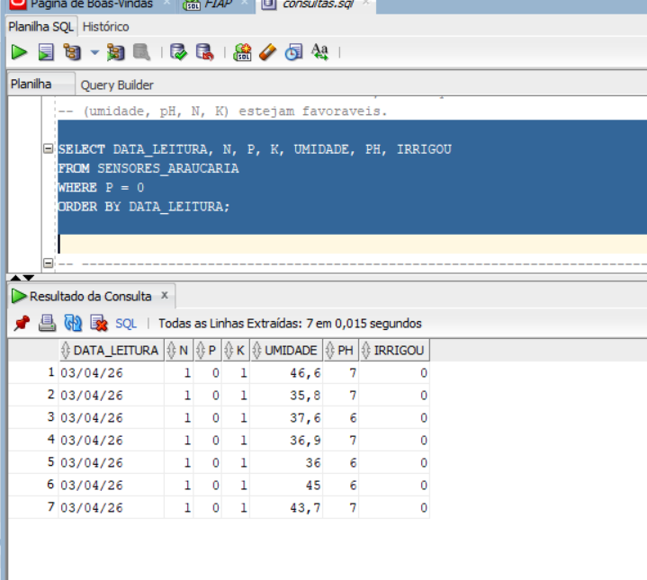

### Consulta 7 — Médias agrupadas por estado da bomba

Compara as condições ambientais médias entre os momentos com e sem irrigação.

```sql
SELECT
    IRRIGOU,
    COUNT(*)                    AS total_leituras,
    ROUND(AVG(UMIDADE), 2)      AS umidade_media_pct,
    ROUND(AVG(TEMPERATURA), 2)  AS temperatura_media_c,
    MIN(UMIDADE)                AS umidade_min,
    MAX(UMIDADE)                AS umidade_max
FROM SENSORES_ARAUCARIA
GROUP BY IRRIGOU
ORDER BY IRRIGOU;
```

**Resultado esperado:** umidade média de **45,99 %** quando `IRRIGOU = 1` (com máximo 59,0 %, justamente o limiar `UMID_SECA – 1`) e **60,34 %** quando `IRRIGOU = 0`. A separação entre os dois grupos comprova que a lógica embarcada no banco bate com a do firmware.

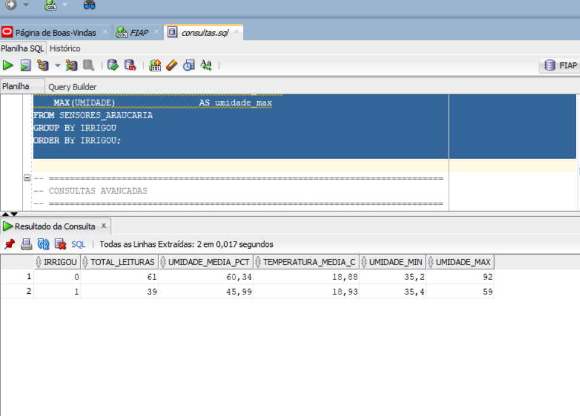

### Consulta 8 — Classificação agronômica (`CASE WHEN`)

Reproduz no banco a tipologia de alertas que o firmware imprimia no Serial Monitor, atribuindo a cada leitura o **primeiro** rótulo cuja regra se aplica.

```sql
SELECT
    DATA_LEITURA,
    UMIDADE,
    PH,
    P,
    CASE
        WHEN PH < 5 OR PH > 7   THEN 'pH fora da faixa'
        WHEN UMIDADE > 75       THEN 'Solo encharcado'
        WHEN P = 0              THEN 'Fosforo ausente'
        WHEN UMIDADE < 60       THEN 'Solo seco - irrigar'
        ELSE                         'Umidade adequada'
    END AS condicao_diagnostica,
    IRRIGOU
FROM SENSORES_ARAUCARIA
ORDER BY DATA_LEITURA;
```

> **Observação analítica:** a contagem de leituras com rótulo `Solo seco - irrigar` (49) é **maior** que o total de irrigações reais (39). A diferença de 10 leituras corresponde aos casos em que o solo está seco e o pH e o fósforo estão ok, mas faltam os dois nutrientes secundários (`N = 0` e `K = 0`) — situação em que o firmware decide **não** irrigar por segurança nutricional. A consulta deixa essa distância entre _necessidade hídrica_ e _decisão final_ explícita.

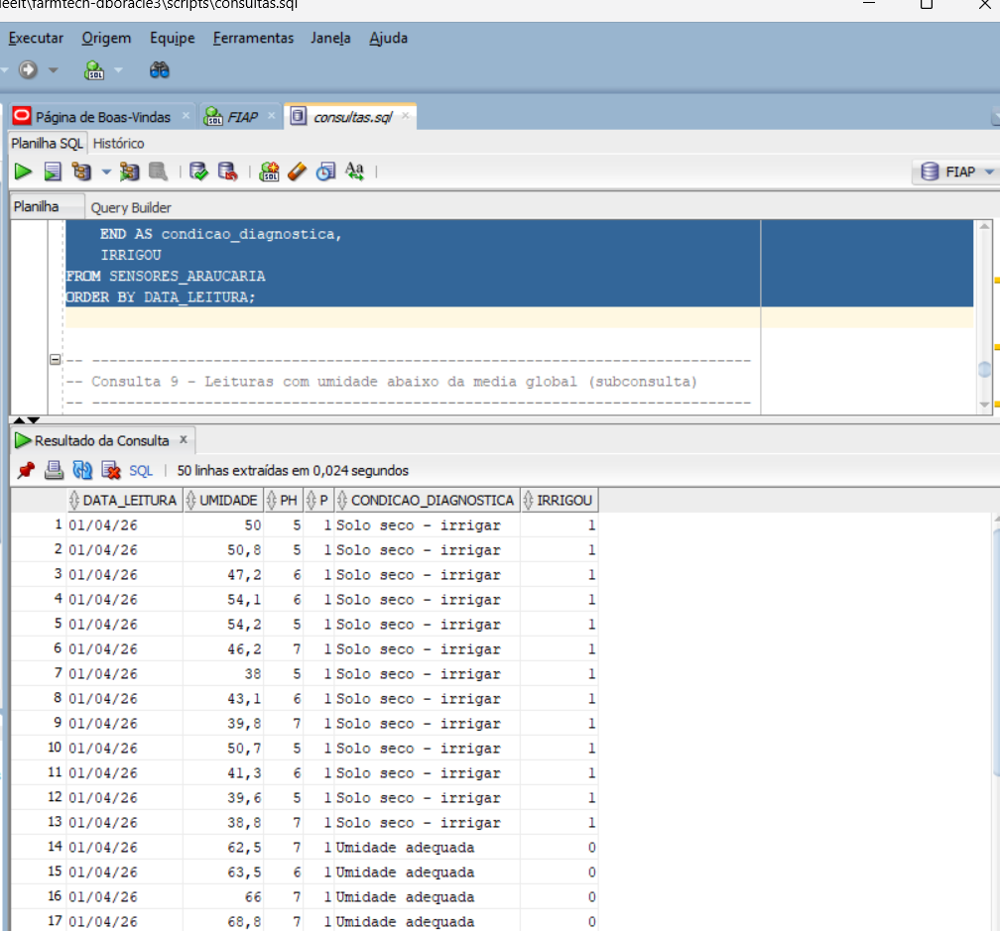

### Consulta 9 — Leituras abaixo da média global (subconsulta)

Compara cada leitura com a média global de umidade, retornando apenas as que ficaram abaixo da média.

```sql
SELECT
    DATA_LEITURA,
    UMIDADE,
    TEMPERATURA,
    IRRIGOU
FROM SENSORES_ARAUCARIA
WHERE UMIDADE < (SELECT AVG(UMIDADE) FROM SENSORES_ARAUCARIA)
ORDER BY UMIDADE;
```

**Resultado esperado:** 62 linhas (umidade < 54,75 %).

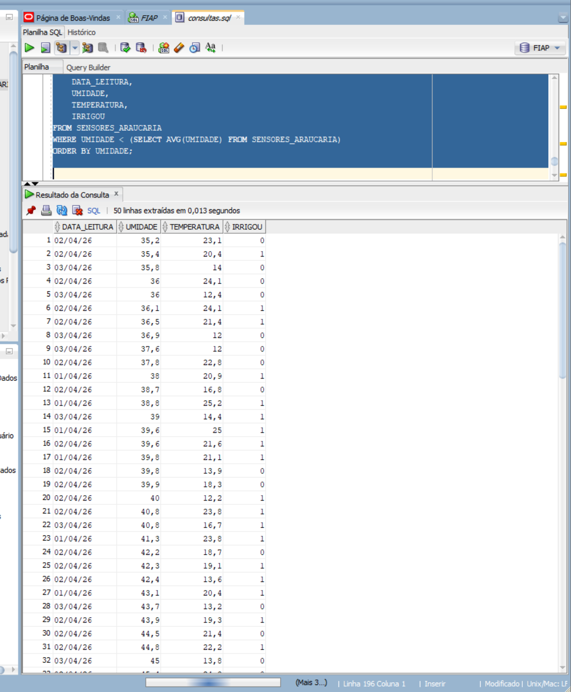

### Consulta 10 — Horas do dia com mais acionamentos (`HAVING`)

Agrupa as irrigações pela hora do dia e mantém apenas as horas com **2 ou mais** acionamentos. Útil para sugerir janelas operacionais e dimensionar o reservatório.

```sql
SELECT
    TO_CHAR(DATA_LEITURA, 'HH24') AS hora_do_dia,
    COUNT(*)                       AS irrigacoes_no_periodo
FROM SENSORES_ARAUCARIA
WHERE IRRIGOU = 1
GROUP BY TO_CHAR(DATA_LEITURA, 'HH24')
HAVING COUNT(*) >= 2
ORDER BY irrigacoes_no_periodo DESC, hora_do_dia;
```

**Resultado esperado:** 16 horas distintas, com **08h** liderando (5 acionamentos).

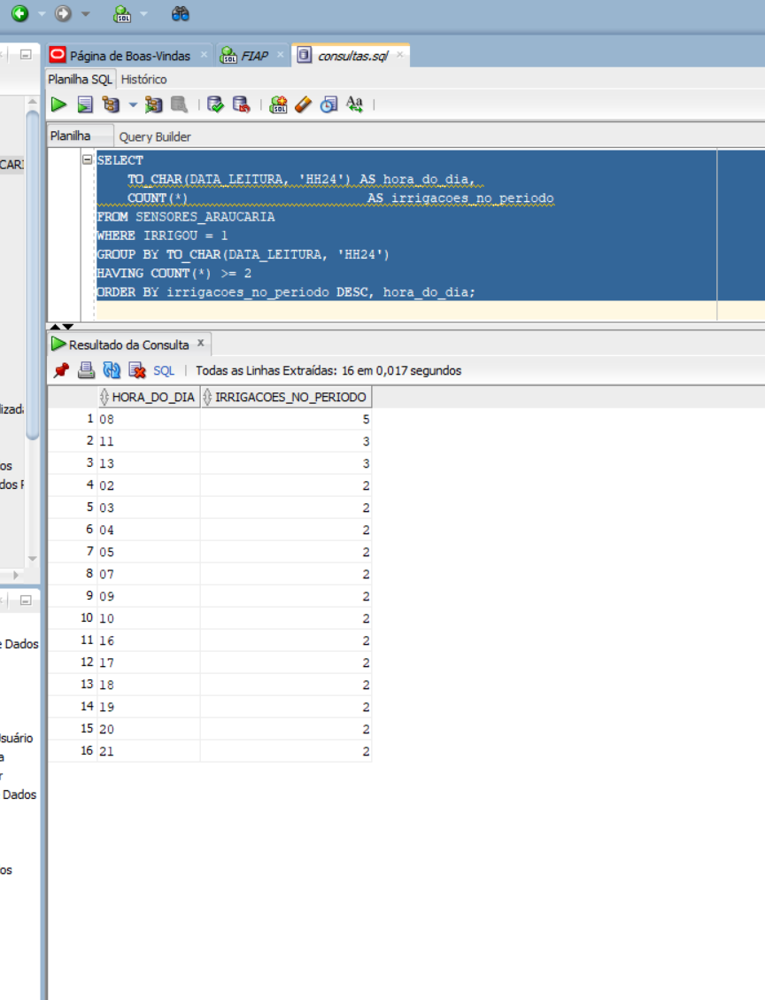

---

## Leitura analítica dos dados

A série de 100 leituras cobre aproximadamente 50 horas consecutivas (`2026-04-01 08:00` a `2026-04-03 09:13`). Combinando os resultados das consultas SQL com a leitura visual da dashboard, é possível tirar algumas conclusões objetivas sobre o regime do viveiro no período.

### Estatística descritiva do período

- **Umidade do solo:** média 54,75% e amplitude 35,2% — 92,0%. A série mistura fases secas (35–55%) com um intervalo de encharcamento concentrado na madrugada do segundo dia.
- **Temperatura do ar:** média 18,9 °C, mínima 12,0 °C (madrugada) e máxima 25,8 °C (início de tarde) — coerente com Curitiba/PR em abril.
- **pH:** a maioria das leituras concentra-se em 5–7 (faixa ideal para a araucária); 10 ocorrências caem fora desse intervalo (valores 3, 4, 8, 9 e 10), simulando excursões temporárias de pH no substrato.

### Padrões temporais

A temperatura segue um **ciclo diurno bem definido**: cai gradualmente até por volta das 5h e sobe até o pico no início da tarde — o que confere com o modelo senoidal típico para a região. A umidade, por outro lado, **não segue ciclo diurno**: evolui em blocos temáticos (período seco → chuva → secagem → recuperação), o que faz sentido para um sensor de solo, cuja variação responde a chuva e irrigação, não à hora do dia.

### Separação entre os dois regimes da bomba

A Consulta 7 mostra uma separação estatística clara entre os dois grupos:

| Estado | N | Umidade média | Umidade máxima |
| --- | --- | --- | --- |
| Bomba **ligada** | 39 | 45,99% | 59,0% |
| Bomba **desligada** | 61 | 60,34% | 92,0% |

A diferença de ~14 pontos percentuais entre as médias e o teto de 59,0% no grupo "ligada" — exatamente `UMID_SECA – 1` — confirmam empiricamente que o limiar de 60% definido no firmware é o discriminador efetivo da decisão.

### Gap entre "necessidade hídrica" e "irrigação efetiva"

A Consulta 8 (`CASE WHEN`) rotula **49 leituras** como "Solo seco — irrigar", porém apenas **39 irrigações** ocorreram. A diferença de 10 leituras revela uma decisão agronômica embutida no `sketch.ino`: nessas 10 leituras o solo estava seco e o pH dentro da faixa, com fósforo presente, mas **N e K estavam simultaneamente ausentes**. O firmware bloqueia a irrigação nesse cenário — sem nutrientes secundários, regar gasta água sem que a planta consiga responder. Esse padrão só fica visível quando se cruza a Consulta 3 (39 irrigações) com a Consulta 8 (49 solos secos), o que justifica manter ambas no script.

### Distribuição agronômica dos alertas

Das 100 leituras, **28 dispararam algum alerta** (Consultas 4, 5 e 6):

- **11** encharcadas (umidade > 75%) — concentradas na madrugada do dia 2;
- **10** com pH fora da faixa (Bloco D do dataset);
- **7** com fósforo ausente (Bloco H).

Nenhuma dessas 28 leituras teve `IRRIGOU = 1` no banco, o que valida na prática que a regra do firmware foi reproduzida com fidelidade no Python que gerou os dados.

### Implicações operacionais

A Consulta 10 sugere que **08h** é a janela de maior demanda (5 acionamentos), seguida por 11h e 13h (3 cada). As demais 13 horas distribuem-se com 2 acionamentos cada, ao longo de quase todo o dia. Para um viveiro real, isso indicaria que o reservatório precisa estar carregado antes do início da manhã, mas que o sistema responde de forma **reativa às condições do solo**, não a um cronograma fixo — exatamente o comportamento esperado de uma irrigação inteligente.

---

## Vídeo demonstrativo

Vídeo de até 5 minutos cobrindo a navegação pelo repositório, a importação do CSV no Oracle SQL Developer e a execução das principais consultas.

_Adicionar link do YouTube aqui_

---

## Como reproduzir

### 1. Regerar o CSV (opcional)

O CSV já está versionado em `dados/`, mas pode ser regerado deterministicamente:

```bash
cd scripts
python gerar_dados.py
```

O script salva o CSV no diretório em que for executado e imprime a distribuição de `irrigou`. Copie o arquivo para `dados/` se quiser substituir o existente.

### 2. Importar no Oracle

1. Abra o Oracle SQL Developer e conecte-se ao seu schema.
2. Execute o bloco `0 - Estrutura da tabela` de `scripts/consultas.sql`.
3. Importe `dados/dados_sensores_fase2.csv` pelo assistente, conforme a seção [Importação no Oracle SQL Developer](#importação-no-oracle-sql-developer).
4. Execute as consultas 1 a 10 em sequência.

### 3. Conferir contra o firmware

`src/sketch.ino` é a referência da regra de irrigação. Comparar a função `calcula_irrigou()` em `gerar_dados.py` com o trecho de decisão do `loop()` no `.ino` é um bom exercício de coerência.

---

## Ir Além 1 — Dashboard interativo

> **Acesso online:** [araucaria.streamlit.app](https://araucaria.streamlit.app/) — a dashboard está **hospedada no Streamlit Community Cloud**, gratuitamente. Não é preciso instalar nada para abrir e interagir; basta clicar no link. A integração com a OpenWeather (Tab "Tempo Real") puxa a previsão de Curitiba/PR em tempo real direto do servidor.

Entrega opcional do "Programa Ir Além". Uma dashboard em **Streamlit** que consome o CSV das 100 leituras da Fase 2 e integra com a **API OpenWeather** em tempo real para recomendar irrigação considerando a previsão do tempo de Curitiba/PR. Fecha o gap apontado pelo professor na Fase 2, em que a integração com Python ficou "conceitual" — agora a regra do firmware é reproduzida e combinada com clima ao vivo num único lugar interativo.

### Visão geral

Quatro tabs organizam a informação:

| Tab | Conteúdo |
| --- | --- |
| **Visão Geral** | 4 KPIs (leituras, umidade média, temperatura média, % irrigações) + série temporal resumo de umidade e temperatura com bandas dos limiares do firmware. |
| **Sensores** | 4 gráficos históricos detalhados: umidade + temperatura empilhadas, timeline da bomba ON/OFF, pH com faixa ideal destacada, heatmap NPK (presença de nutrientes ao longo do tempo). |
| **Diagnóstico** | Donut de distribuição por condição agronômica com **% de solo saudável** no centro + timeline mostrando **quando** cada alerta aconteceu + tabela das leituras com alerta. Reproduz o `CASE WHEN` da Consulta 8 do `consultas.sql`. |
| **Tempo Real** | Cards horizontais com previsão OpenWeather das próximas 12h + simulador "Irrigar agora?" com sliders e toggles. Resultado combina a regra do firmware com a previsão de chuva para devolver **IRRIGAR / SUSPENDER / NÃO IRRIGAR** com motivo explicado. |

### Tecnologias

| Lib | Função |
| --- | --- |
| `streamlit` | Framework do dashboard. |
| `pandas` | Manipulação do CSV. |
| `plotly` | Gráficos interativos com `fillgradient` e splines suaves. |
| `requests` | Chamadas à API OpenWeather. |
| `python-dotenv` | Carrega a `OPENWEATHER_API_KEY` do arquivo `.env` (nunca vai para o git). |

### Como rodar localmente

```powershell
cd iralem1_dashboard
pip install -r requirements.txt

# Configurar a chave da API
copy .env.example .env
notepad .env
# Cole sua OPENWEATHER_API_KEY (gere em https://home.openweathermap.org/api_keys)

streamlit run app.py
```

O Streamlit abre em `http://localhost:8501`. A Tab Tempo Real só ativa a previsão se a chave estiver no `.env`; sem ela, o simulador continua funcionando assumindo "sem chuva prevista".

### Coerência com a Fase 2

A regra de irrigação aparece em **quatro lugares**, todos sincronizados:

1. **`src/sketch.ino`** (Fase 2) — `if (soloSeco && phOk && !encharcado && nutrientesOk) irrigar = true;`
2. **`scripts/consultas.sql`** (Fase 3 obrigatório, Consulta 8) — `CASE WHEN` com a mesma priorização.
3. **`iralem1_dashboard/src/data_loader.py`** — função `classificar_condicao()` que rotula cada leitura.
4. **`iralem1_dashboard/src/decisao.py`** — função `decisao_firmware()` consumida pelo simulador.

A Tab Tempo Real ainda combina essa regra com o módulo `weather.py` (OpenWeather), produzindo a decisão final híbrida — exatamente o que o opcional 1 da Fase 2 sugeria mas executava manualmente.

### Walkthrough das telas

Cinco prints de desktop e dois de mobile, salvos em `iralem1_dashboard/prints/`. Em vez de listar e despejar, cada captura está embutida abaixo junto com o insight que ela acrescenta sobre as 100 leituras da Fase 2.

#### `dash_01_visao_geral.png` — Tab "Visão Geral"

Os quatro KPIs no topo (total de leituras, umidade média, temperatura média, % de irrigações) resumem o regime do viveiro em uma linha — é o equivalente visual da Consulta 2. O gráfico de série temporal abaixo plota umidade e temperatura com **bandas dos limiares do firmware** sobrepostas (faixa coral em 0–60% para "solo seco" e faixa azul em 75–100% para "encharcado"), de modo que cada vez que a curva de umidade cruza a linha de 60% fica visível o motivo do acionamento da bomba.

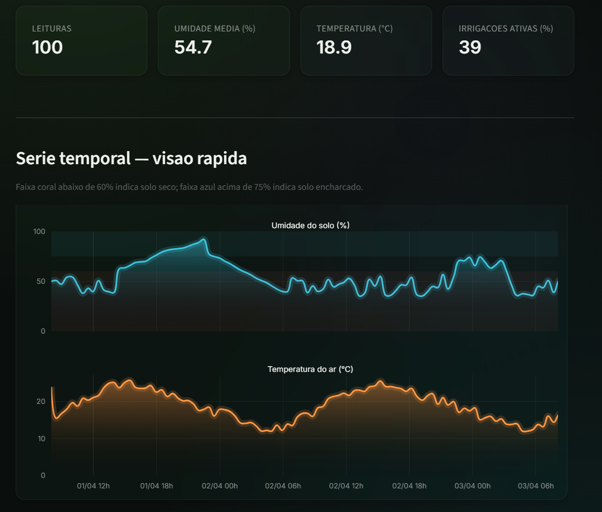

#### `dash_02_sensores.png` — Tab "Sensores"

Quatro gráficos detalhados, um por grupo de sensores. A **timeline da bomba** (barras verticais ON/OFF) é a mais reveladora: cada barra cai exatamente no vale de umidade do gráfico imediatamente acima, comprovando visualmente o que a Consulta 7 mostra estatisticamente — que a bomba liga quando umidade < 60%. O painel de pH destaca a faixa ideal `[5, 7]` em verde, e o heatmap NPK mostra a depleção e a reposição manual dos nutrientes ao longo das 50 horas.

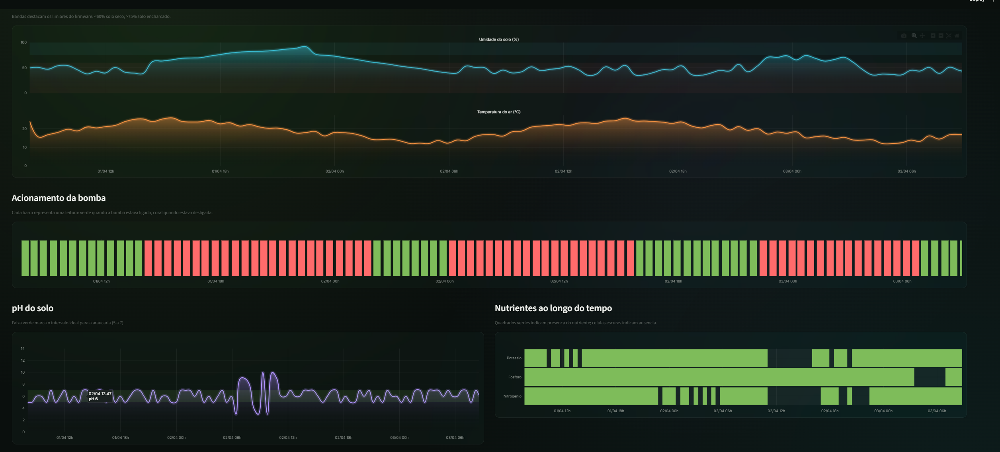

#### `dash_03_diagnostico.png` — Tab "Diagnóstico"

Reproduz visualmente o `CASE WHEN` da Consulta 8: o donut classifica as 100 leituras nas 5 condições agronômicas, com o **% de solo saudável** no centro. A timeline ao lado mostra **quando** cada alerta aconteceu — o cluster de "Solo encharcado" concentrado na madrugada do dia 2 salta aos olhos, algo que a consulta SQL só revelava ordenando por `DATA_LEITURA`. A tabela abaixo lista as 28 leituras com alerta para inspeção pontual.

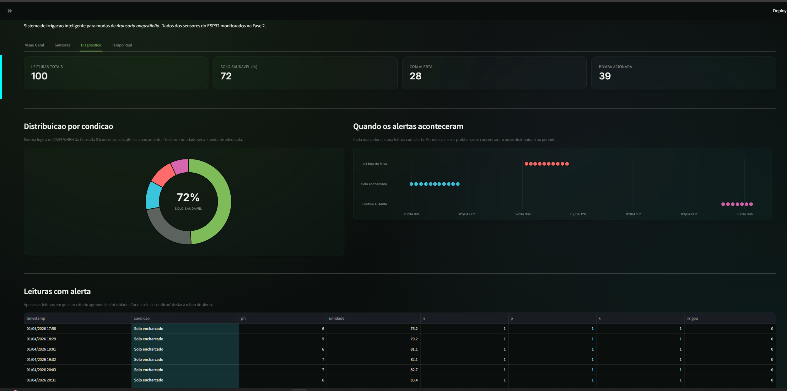

#### `dash_04_tempo_real.png` — Tab "Tempo Real"

A tab que **estende** a Fase 3 para além do dataset histórico: cards horizontais com a previsão OpenWeather das próximas 12 h para Curitiba/PR + simulador "Irrigar agora?" com sliders e toggles para cada sensor. É aqui que a regra do firmware encontra o clima ao vivo — fecha o opcional 1 da Fase 2, que ficou conceitual à época.

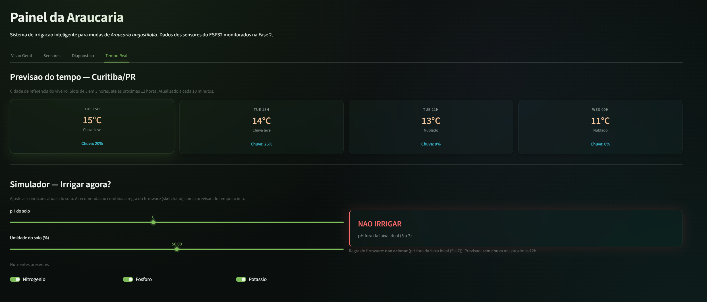

#### `dash_05_simulador_decisoes.png` — Três estados do simulador

Captura composta dos três veredictos possíveis, lado a lado:

- **IRRIGAR** (verde) — solo seco, pH dentro da faixa, fósforo presente, sem chuva prevista.
- **SUSPENDER** (laranja) — todas as condições do firmware satisfeitas, **mas** a previsão indica chuva nas próximas 12 h → a dashboard recomenda esperar.
- **NÃO IRRIGAR** (vermelho) — alguma condição do firmware falha (encharcamento, pH fora, fósforo ausente, ou N e K simultaneamente zerados).

A categoria **SUSPENDER** só existe na camada Python — o firmware sozinho só conhece IRRIGAR / NÃO IRRIGAR. É o ganho concreto da dashboard sobre o ESP32 isolado.

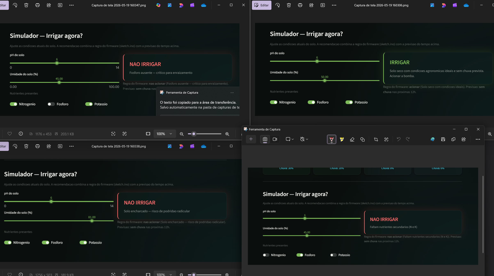

#### `dash_06_mobile_geral.png` e `dash_07_mobile_diagnostico.png` — Layout responsivo

Abaixo de 768 px, um bloco de `@media` no CSS do `app.py` força `flex-direction: column` nos containers de colunas do Streamlit: os 4 KPIs deixam de ficar lado a lado e empilham um por linha em largura total, e na tab Diagnóstico o donut e a timeline também empilham verticalmente. Os gráficos preservam a proporção porque foram criados com `width="stretch"` e sem largura fixa no `charts.py`.

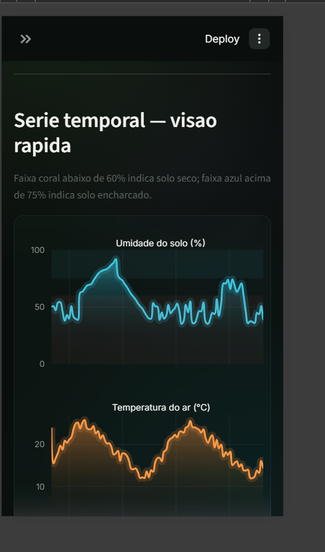
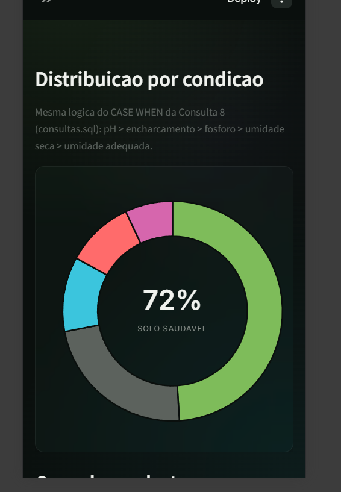

> Para reproduzir os prints mobile: `F12` → `Ctrl+Shift+M` → escolha "iPhone 12 Pro" no dropdown → `Ctrl+F5` para recarregar.

### Vídeo demonstrativo do dashboard

https://www.youtube.com/watch?v=WqOEoQaPj4g---

## Créditos

**Leticia Eltermann** — RM568645
Curso de IA — FIAP — Fase 3 (Banco de Dados)

GitHub: [@leticiael](https://github.com/leticiael) · Fase 2: [Farmtech-ESP32-](https://github.com/leticiael/Farmtech-ESP32-)
